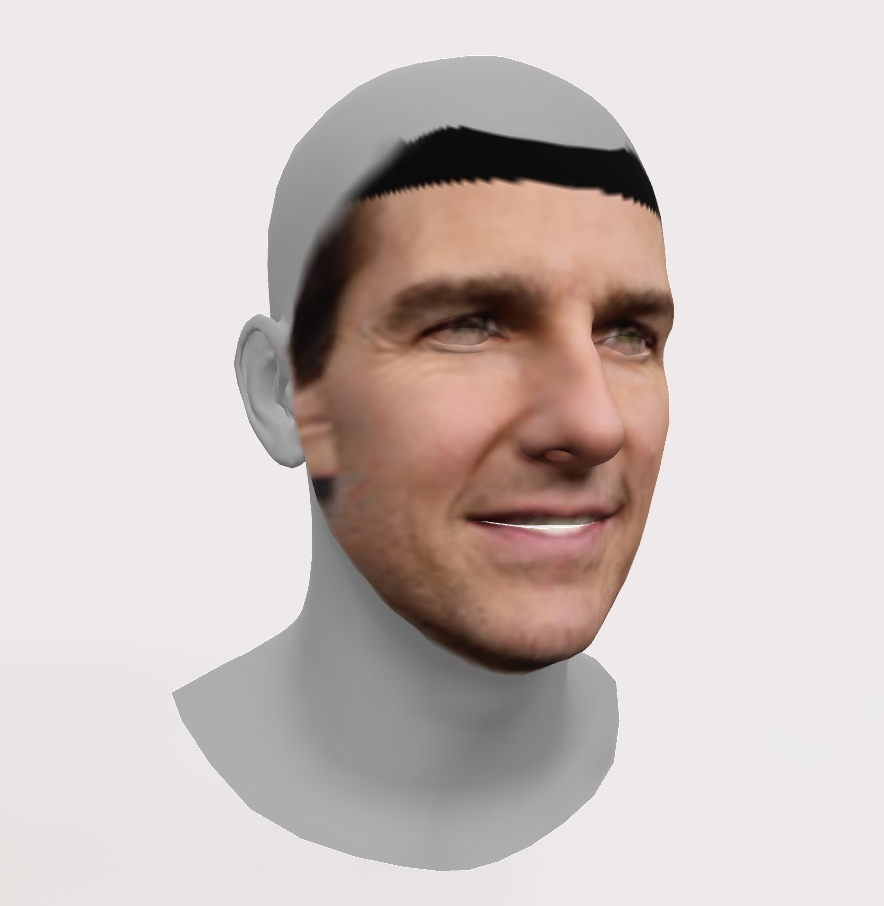

# Facemodel

Create 3D head models from a selfie. Facemodel outputs USDZ (an iPhone AR compatible format) and GLB, a more general 3D model format.

This repo contains:
* machine learning code to generate a 3D model
* conversion service to generate USDZ and GLB files
* nginx and front end to serve 3D model results

## Usage

The machine learning component of Facemodel requires a GPU-enabled nvidia docker runtime. This code has been tested on an AWS `p2.xlarge` EC2 instance.

### Build
`docker-compose build`

### Run
`docker-compose up`